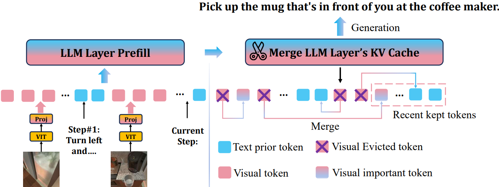

<div align="center">
 <br>
</div>

<h2 align="center"><a href="https://aclanthology.org/2024.findings-emnlp.235/">🔭LOOK-M: Look-Once Optimization in KV Cache for Efficient Multimodal Long-Context Inference </a></h2>

> *<sup>1</sup>The Ohio State University, <sup>2</sup>Peking University, <sup>3</sup>Imperial College London, <sup>4</sup>Tencent AI Lab*

<h5 align="center"> If you find our project helpful, please give us a star ⭐ on GitHub to stay updated.</h5>


<h5 align=center>

[](https://github.com/huggingface/transformers)
[](https://arxiv.org/abs/2406.18139)
[](https://github.com/SUSTechBruce/LOOK-M/blob/main/LICENSE)

</h5>

## Overview
Long-context Multimodal Large Language Models (MLLMs) demand substantial computational resources for inference as the growth of their multimodal Key-Value (KV) cache, in response to increasing input lengths, challenges memory and time efficiency.

Unlike single-modality LLMs that manage only textual contexts, the KV cache of long-context MLLMs includes representations from multiple images with temporal and spatial relationships and related textual contexts. The predominance of image tokens means traditional optimizations for LLMs' KV caches are unsuitable for multimodal long-context settings, and no prior works have addressed this challenge.

<div style="text-align: center;">
    
</div>

In this work, we introduce LOOK-M, a pioneering, fine-tuning-free approach that efficiently reduces the multimodal KV cache size while maintaining performance comparable to a full cache. We observe that during prompt prefilling phase, the model prioritizes more textual attention over image features, and based on the multimodal interaction observation, a new proposed text-prior method is explored to compress the KV cache.

Furthermore, to mitigate the degradation of image contextual information, we propose several compensatory strategies using KV pairs merging. LOOK-M demonstrates that with a significant reduction in KV Cache memory usage, such as reducing it by 80% in some cases, it not only achieves up to 1.5x faster decoding but also maintains or even enhances performance across a variety of long context multimodal tasks.


## Usage

### Environment Setup
The Environments Setup is consistent with Milebench
```
conda create -n LOOK-M
pip install -r requirements.txt
```

### Test LOOK-M and other KVCache Eviction Strategy
Example 1. test LOOK-M
```
conda activate LOOK-M
bash ./scripts/text-prior-pivot-merge_eval.sh
```
Exampke 2. test model without strategy
```
conda activate LOOK-M
bash ./scripts/origin_eval.sh
```
## TODO

- [ ] reorgnize the code for better using experience
- [ ] support more models

## Citation

#### If you find our work valuable, we would appreciate your citation: 🎈


```bibtex
@article{wan2024look,
  title={LOOK-M: Look-Once Optimization in KV Cache for Efficient Multimodal Long-Context Inference},
  author={Wan, Zhongwei and Wu, Ziang and Liu, Che and Huang, Jinfa and Zhu, Zhihong and Jin, Peng and Wang, Longyue and Yuan, Li},
  journal={arXiv preprint arXiv:2406.18139},
  year={2024}
}
```


#### The code is still being organized.🚧
